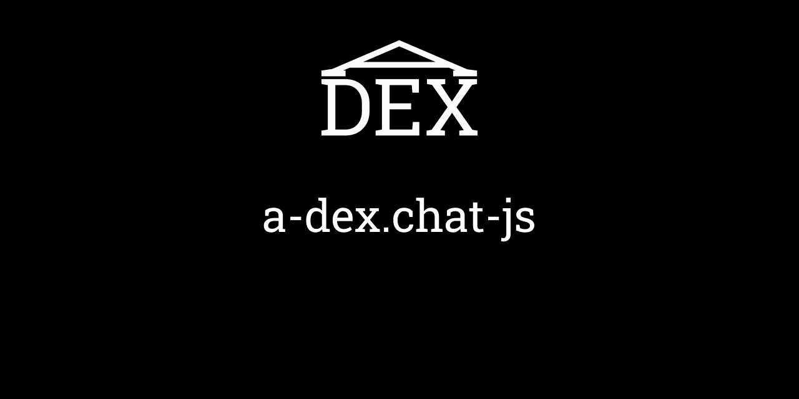

<p align="center">
	
</p>

# a-dex.chat-js

## Usage

This is a [Node.js](https://nodejs.org/en/) module available through the
[npm registry](https://www.npmjs.com/). Installation is done using the
[`npm install` command](https://docs.npmjs.com/getting-started/installing-npm-packages-locally):

```sh
npm i @a-dex/a-dex.chat-js
```

### Initialize

Web library can be found in the [dist] folder
